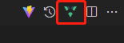

### **建议使用右上角 _预览_ 按钮预览此文档，或者同时按 Ctrl + K 然后单按 V**

---

## 必须使用的编辑器和插件

- [Visual Studio Code](https://code.visualstudio.com/) 基础编辑器
- [Volar](https://marketplace.visualstudio.com/items?itemName=johnsoncodehk.volar) vue3 支持

  - 请勿使用 `vetur`，这是老版插件，已弃用

  - 可以点此按钮拆分编辑器  
    

## 建议使用的插件

- [Prettier](https://marketplace.visualstudio.com/items?itemName=esbenp.prettier-vscode) 自动格式化代码

  格式化快捷键 `Shift + Alt + F`  
  请将 `Prettier` 设置为默认的格式工具

## 必须使用的包管理器

- [pnpm](https://www.pnpm.cn/) 速度更快的 npm

  ```sh
  npm install -g pnpm
  ```

  请勿使用 `npm`、 `yarn`、`cnpm` ，因为项目的包锁是 `pnpm-lock.yaml`

## 项目中使用的技术

建议每个都看一遍文档

- [vue3](https://v3.cn.vuejs.org/) vue
- [typescript](https://www.typescriptlang.org/) 提供类型检查
- [scss](https://sass-lang.com/) 样式预处理器
- [vite](https://cn.vitejs.dev/) 新一代打包工具，比 webpack 快很多
- [tailwindcss](https://www.tailwindcss.cn/docs) 可以节省很多样式代码，内置了大量的 css class
- [windicss](https://cn.windicss.org/) tailwindcss 的改进版
- [vue-router](https://next.router.vuejs.org/zh/) 路由
- [antd](https://2x.antdv.com/components/overview-cn/) antd ui 库
- [element-plus](https://element-plus.org/zh-CN/) element ui 库
- [quill](https://quilljs.com/) 富文本编辑器

## 项目代码规范

鉴于 `eslint` 有各种各样的问题，所以项目没有使用代码规范检查  
但是请大家自觉遵守代码规范、

- 细节代码风格以格式化（`Prettier`）为准

- 组件命名、类名称、命名控件名称、类型名称

  `CamelCase` 首字母大写的驼峰

- 函数、方法命名、变量命名

  `camelCase` 首字母小写的驼峰

- 文件夹名称、杂项（静态资源、.ts 等）文件名称、偷懒直接用中文命名

  `under_score` 小写单词（或中文）中间用下划线分隔

- 文件夹、杂项文件名称尽量单个单词
- 通用组件名称请最起码由 2 个单词组成  
  例如 `UiFoo`、`VFoo`
- 专用组件请转专门起个文件夹存放
- 同个组件分多个文件时，请建个文件夹，文件夹名使用组件名

_注：当前项目可能没有完全遵守此规范，但是之后请遵守_

## 项目结构

- `.vscode`  
  编辑器相关配置文件
- `dev`  
  仅开发时候使用的文件  
  如果需要写构建脚本请放这里

  - `genApi.mjs`  
    接口生成脚本，会自动从后端读取接口定义和类型定义

    ```js
    const groups = {
      // 可以设置多个不同接口源，这里的 mian 就是接口源名，不同接口源需要使用不同的源名，源名是自定义的
      main(o) {
        o.baseUrl = '接口地址'
        o.defines = ['要生成的接口分组']
      },
    }
    ```

- `public`  
  真的纯静态文件，直接扔到打包后不会经过任何编译

- `src`  
  源码

  - `api`  
    生成的 api 都放在这里

  - `assets`  
    存放静态资源

  - `common`  
    通用杂项

  - `components`  
    通用组件

  - `home`、`info`、`login`、`system`  
    页面，比较乱，以后可能会改

  - `icons`  
    图标
  
  - `utils`  
    通用工具库  

  - `新建模板.vue`  
    新建 `.vue` 文件时，把模板里的代码复制到新文件   

  - `antd.ts`  
    antd 换名，以后可能会改

  - `App.vue`  
    页面入口点

  - `config.ts`  
    全局配置，请求接口的路径在这里配置  

  - `main.ts`  
    主入口点

  - `router.ts`  
    路由配置

  - `store.ts`  
    全局数据存储

- `.gitignore`  
  git 忽略文件

- `.prettierrc`  
  格式化配置文件

- `index.html`  
  基础 html 代码

- `package`  
  包定义文件

- `pnpm-lock.yaml`  
  包锁文件

- `tsconfig.json`  
  ts 配置文件

- `vite.config.ts`  
  vite 配置文件

## 其他备注

- 请勿使用 vue cli  
  项目用的是 vite，和 vue cli 没关系

- 快速替换 c# 文档注释到 ts 文档注释的正则，Ctrl + H 开启替换  
  上面填
  ```
  /// <summary>\n\s*/// (.*)\n\s*/// </summary>
  ```
  下面填
  ```
  /** $1 */
  ```
- 快速替换 c# 类型 public { get set } 到 ts 接口类型  
  上面填
  ```
  public (.*) (.*) \{ get; set; \}
  ```
  下面填
  ```
  $2: $1
  ```
